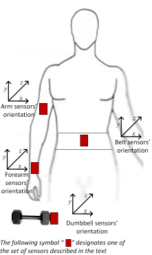

```{r setup, include=FALSE}
knitr::opts_chunk$set(echo = TRUE)
```

## Summary

The Weight Lifting Excercise (WLE) Dataset (http://groupware.les.inf.puc-rio.br/har) is analyzed with various machine learning tools.

The analysis indicates that the random forest model can provide the most accurate fitting for the data. 

The prediction of the *testing* dataset is given at the end of the report.

## Introduction

The Weight Lifting Excercise (WLE) Dataset is given at http://groupware.les.inf.puc-rio.br/har which comprises the data measured by the sensors located on the body and dumbell as shown in the figure below. The dataset was obtained for 6 participants who were asked to perform barbell lifts correctly and incorrectly in 5 different ways: exactly according to the specification (Class A), throwing the elbows to the front (Class B), lifting the dumbbell only halfway (Class C), lowering the dumbbell only halfway (Class D) and throwing the hips to the front (Class E). Class A corresponds to the specified execution of the exercise, while the other 4 classes correspond to common mistakes.



The goal of this analysis is to build a model that can predict the manner or the way in which people did the excercise (the class variable) based on the sensor data.


## Classification tree model

A classification tree model is going to be built which classifies the exercise class based on the sensor data.  

The data are imported as follows

```{r}
training <- read.csv("pml-training.csv",na.strings=c("NA","#DIV/0!",""))
testing <- read.csv("pml-testing.csv",na.strings=c("NA","#DIV/0!",""))
```

Columns that contains NA, blanks and unnecessary information, e.g. "X", "user_name", "*timestamps, etc, are removed 
```{r}
nonNACols <- colSums(is.na(training)) == 0
training <- training[,nonNACols]
testing <- testing[,nonNACols]
nonEmpCols <- colSums(training == "") == 0 
training <- training[,nonEmpCols]
testing <- testing[,nonEmpCols]
training <- training[,-c(1:7)]
testing <- testing[,-c(1:7)]
dim(training)
dim(testing)
```

As shown above, the training set has 19622 rows and 53 columns (features), whereas the cross-validation set has only 20 rows and similar number of columns. 

The *nearZeroVar* function is used to find the columns for which the variances are equal to or near zero
```{r message=FALSE, warning=FALSE}
library(caret)
nearZeroVar(training)
```

The above check indicates that there is no such column (or variable).


The training set is splitted into *mTraining* and *mCrossVal* datasets as follows
```{r message=FALSE, warning=FALSE}
inTrain <- createDataPartition(y=training$classe,p=0.6,list=FALSE)
mTraining <- training[inTrain,]
mCrossVal <- training[-inTrain,]
```

A classification tree model is constructed as follows
```{r message=FALSE}
library(rpart)
set.seed(1234)
rpModel <- train(classe ~ .,method="rpart",data=mTraining)
```

The classification tree is plotted with the *fancyRpartPlot* function:
```{r message=FALSE, warning=FALSE, fig.width=20, fig.height=10}
library(rattle)
fancyRpartPlot(rpModel$finalModel,sub="")
```

The *rpart* model is used to predict the *mCrossVal* dataset as follows
```{r}
rpPred <- predict(rpModel,mCrossVal)
```

The accuracy of this model is found to be
```{r}
confusionMatrix(rpPred,mCrossVal$classe)$overall['Accuracy']
```
which seems to be low.

It is intersting to note that using the independent *rpart* fitting instead of *train* results in a different classification tree and a higher accuracy as shown below.

```{r message=FALSE, warning=FALSE, fig.width=20, fig.height=10}
set.seed(1234)
rpModel <- rpart(classe ~ .,data=mTraining)
fancyRpartPlot(rpModel,sub="")
rpPred <- predict(rpModel,mCrossVal,type="class")
confusionMatrix(rpPred,mCrossVal$classe)$overall['Accuracy']
```

## Random forest (rf) model

A random forest is constructed as follows

```{r message=FALSE, warning=FALSE}
library(randomForest)
set.seed(1234)
rfModel <- randomForest(classe~.,data=mTraining)
print(rfModel)
```

The class errors versus the tree number is plotted as
```{r}
plot(rfModel)
```

As seen from the plot, the number of tree can be reduced to about 230 with minimal changes in the model error

```{r message=FALSE, warning=FALSE}
library(randomForest)
set.seed(1234)
rfModel <- randomForest(classe~.,data=mTraining,ntree=90)
print(rfModel)
```

The variable importance can be analyzed using the *varImpPlot* function
```{r}
varImpPlot(rfModel,main="Variable importance plot - PSA score")
```

which shows the order of the variable importance on the vertical axis labels (the top variable *roll_belt* is most important, etc.). 


The *rfModel* is used to predict the cross-validation data *mCrossVal* as follows
```{r}
rfPred <- predict(rfModel,mCrossVal,type="class")
confusionMatrix(rfPred,mCrossVal$classe)$overall['Accuracy']
```

This random forest model is seen to have a significantly higher accuracy compared to the classification/regression tree model.


## Gradient boosting (gbm) model

A *gbm* is constructed as follows
```{r  message=FALSE, warning=FALSE}
library(gbm)
control <- trainControl(method="CV",number=5)
set.seed(1234)
gbModel <- train(classe ~ ., data=mTraining, method="gbm", trControl=control, verbose=FALSE)
```
The accuracy of this model is

```{r}
gbPred <- predict(gbModel,mCrossVal)
confusionMatrix(gbPred,mCrossVal$classe)$overall['Accuracy']
```
which is better than the rpart model but is not as good as the random forest model.

The *summary* function indicates the order of variable importance as follows
```{r}
summary(gbModel$finalModel)
```

## Prediction of the *testing* dataset with the random forest model


The prediction of the *testing* dataset is shown below 

```{r}
testingPred <- predict(rfModel,testing,type="class")
testingPred
```


## Reference

Velloso, E.; Bulling, A.; Gellersen, H.; Ugulino, W.; Fuks, H. Qualitative Activity Recognition of Weight Lifting Exercises. Proceedings of 4th International Conference in Cooperation with SIGCHI (Augmented Human '13) . Stuttgart, Germany: ACM SIGCHI, 2013.(http://groupware.les.inf.puc-rio.br/har)
